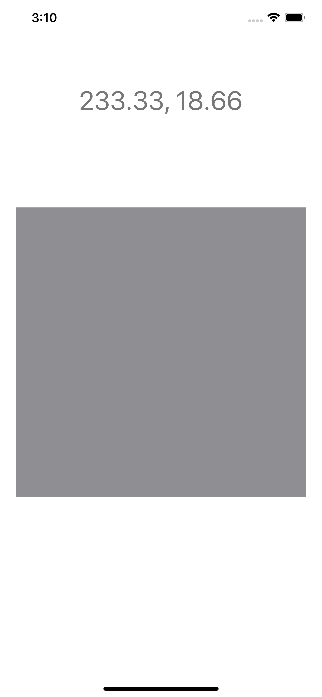

# UITapGestureRecognizer Experiment

## Objective

I wanted to understand how `UITapGestureRecognizer` worked, so I built a simple iOS app that demonstrates how it works.



The app loads with a gray square in the middle of the screen. If you tap anywhere on that square, the label at the top of the screen will show the exact location (`CGPoint`) of where you tapped.


## Key Learnings

1) You can add a `UIGestureRecognizer` to any `UIView`. In this example, `funView` is a `UIView` that was added as an `IBOutlet` in my ViewController.

```Swift
// in ViewController \ viewDidLoad()
let gestureRecognizer = UITapGestureRecognizer(target: self, action: #selector(changeColor))
gestureRecognizer.numberOfTapsRequired = 3
funView.addGestureRecognizer(gestureRecognizer)
```


2) Define a function that does the actions you want after the user taps that view. Also, pass that function as a parameter to the initializer in step 1.

```Swift
@objc func changeColor(_ sender: UITapGestureRecognizer) {
	funView.backgroundColor = UIColor.red
	
	let tappedView = sender.view!
	tappedView.layer.borderWidth = 5.0
	tappedView.layer.borderColor = UIColor.purple.cgColor
}
```


Other notes:

* One-to-one relationship between `UIGestureRecognizer` and `UIView`
* `UITapGestureRecognizer` has a property known as `location` which returns a `CGPoint`
* The `location` is relative to the top left corner the UIView.
* The top left corner of the UIView is the origin or `(0.0, 0.0)`
* What is the unit of measure of the CGPoint? The official answer is [complicated](https://developer.apple.com/documentation/coregraphics/cggeometry).

> A CGPoint, CGRect, or CGSize structure does not explicitly define the unit of measure for its member quantities. A point’s x- and y-coordinates or a size’s width and height are unitless quantities—whether such measurements are treated as pixels, scale-factor-independent points, texture elements (texels), or some other unit depends on the API using the measurement, and on the context in which that API is used. 


## Specs

* Swift 5
* Xcode 11.4


## Mad Props

[Jim Campagno's tutorial on UITapGestureRecognizer](https://youtu.be/nods-bRV_BY)

[UIGestureRecognizer - location](https://developer.apple.com/documentation/uikit/uigesturerecognizer/1624219-location)

[Truncate Float - StackOverflow](https://stackoverflow.com/questions/35946499/how-to-truncate-decimals-to-x-places-in-swift)
